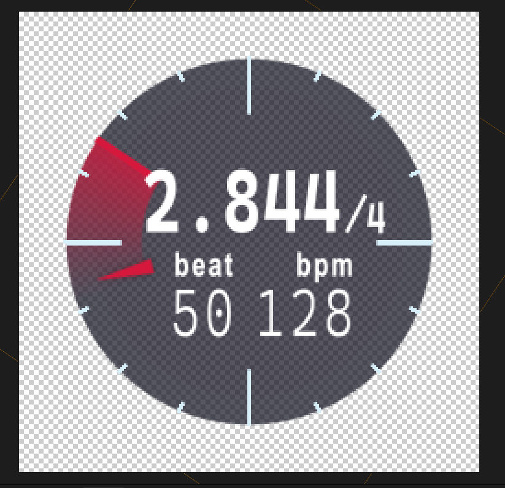

# clock.aep_v2

時計型でリズムを表示するaep / aep file of a clock-style rhythm display tool

## 概要 / Overview

[yama_ko](https://www.yama-ko.net/)さんが2018年 AEOFFで配布していた[clock.aep](https://x.com/yama_ko/status/1012951706005430272)を魔改造して便利にしました。
既存機能に加え、以下の機能を追加してます:

- [x] 複合拍子・混合拍子の対応 (3/4拍子、6/8拍子など)
- [x] BPMのアニメーションへの対応
- [ ] 変拍子・拍子のアニメーションへの対応
- [x] UIの色のカスタマイズ
- [x] essential graphics対応
- [ ] 拍の長さ表示
- [ ] コンポジションマーカーによる拍数表示・BPM逆算表示

英語環境・AE2023以上で動作確認済みです。多分、多言語環境や過去バージョンでも動くと思います。
プラグイン等は使っておらず、標準エフェクトのみで完結しています。

使う場合は、aepを他のaepを開いた状態でD&Dして、コンポジションを配置し使ってください。
また、Essential Graphicsを設定済みなので、配置したコンポジションからパラメーターを弄ったり、premireで使えたりするはずです。

## 使い方 / How to use

1. リポジトリから[`clk_cc2023.aep`](https://github.com/Aodaruma/clock.aep_v2/raw/refs/heads/main/clk_cc2023.aep)をダウンロード
2. 他のプロジェクトを開いた状態で、ダウンロードしたaepをD&D
3. コンポジションを配置し、パラメーターを操作

## パラメーター説明 / Description of parameters

- Settings
  - `BPM`: 時計のBPMの設定。アニメーションする場合は`Is bpm animated?`をONにしてください。
  - `beat`: 拍子の設定。
  - `beatlevel`: 拍の長さの設定。4にすると四分音符、8にすると八分音符になります。
  - `Is bpm animated?`: 曲のBPMが変化する場合に有効にします。各フレームに対して総和計算するので、後半に行くにつれてとても重いです。
- UI settings
  - `Base Color`: UIのベースカラー
  - `Contrast Color`: UIのコントラストカラー
  - `Accent Color`: UIのアクセントカラー
  - `Beat Measure Substeps`: 小目盛りの分割数。

## 改善点や問題が発生した場合 / If you have any improvements or problems

このリポジトリにてIssueを立ててください。Pull Requestも歓迎します。
英語でも日本語でも大丈夫です。

## ライセンス / License

MIT License
